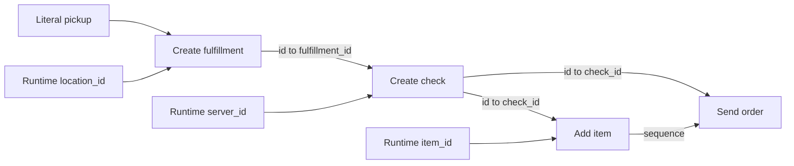

# Successful demo workflow: mapping and planning review

Public-copy note: internal intake references have been redacted. Manifest file hashes describe this sanitized copy, not the original capture.

This capture preserves the active `demo` workflow, its successful sandbox execution, and its successful API execution on September 7, 2026. It is an evidence snapshot for later refinement, not a new run or a change to the workflow.

## What succeeded

| Record | Value |
| --- | --- |
| Organization / environment | `org_atlas` / `development` |
| Workflow identity | `workflow_ce16e294-ab6d-42fe-8742-7b4c6513f726` |
| Workflow version | `workflow-20260907-222502-659` |
| Saved at | 2026-09-07 22:26:36.373 UTC / 5:26:36 PM Central |
| Sandbox run | `1`, passed at 22:27:19.092 UTC / 5:27:19 PM Central |
| Approval | `atlas-admin`, 22:28:19.139 UTC / 5:28:19 PM Central |
| IR hash | `34844ef3ab954632102c837a89aa3237bdd86db281012ac05e575ef7b840da7a` |
| Projection fingerprint | `8d35fc9fc07394c30739e7acd9cbe2a4ae37da63fd0a52e111f33d078a77935f` |
| Happy-path Temporal workflow | `atlas:sandbox:workflow-20260907-222502-659:7cd0681b-5dd7-48d0-a040-4654bc25faa7` |
| Happy-path Temporal run | `01a07dfb-008e-7570-b9f1-6c1c7ed4dcaa` |

The database records 16 passed checks: one happy path, four contract-mapping checks, four duplicate-event checks, four compatibility checks, and three partial-failure checks. The happy path completed all four capabilities on their first attempt, with HTTP statuses 201, 201, 201, and 200. Its saved Temporal summary reports eight completed activities, zero failed activities, and zero timed-out activities. The provider summary reports four side effects.

The first read had no ordinary API execution; a subsequent capture found the completed API run below. The archive includes both successes. Source: [sandbox database export](evidence/sandbox-runs.jsonl), [catalog](evidence/catalog.json), [completed runs](evidence/completed-runs.json), and [full API run detail](evidence/api-run.json).

| API execution record | Value |
| --- | --- |
| Run ID | `atlas:run:atlas.workflow-run-id:ae7e889789c62b68d05385a3b6f79e323b6009db61687650304aca6447b0e774` |
| Artifact ID | `4af86597f6129f861269a4723e30de3081f7e8812fd0d28e1d276c1779d10f06` |
| API delivery ID | `82f4ed27-053f-43b5-9d50-6cd97e807a6d:0:0` |
| Lifecycle start / end | 22:28:47.413 UTC / 22:28:48.744 UTC |
| Duration | 1,331 ms |
| Outcome / retries | succeeded / 0 |
| Capability attempts | all four succeeded on attempt 1 |
| Recorded step durations | fulfillment 32 ms; check 18 ms; add item 35 ms; send 16 ms |
| Duplicate submissions | 0 |

Run detail includes the timeline, effects, saga state, repair history, and idempotency evidence. Input and output values in this API record are redacted at the customer worker, as documented by its privacy metadata; these records cannot reconstruct the final checkout body.

## Exact final mapping



| Step | Destination field | Saved source | Saved origin label |
| --- | --- | --- | --- |
| create_fulfillment | type | literal `pickup` | inferred |
| create_fulfillment | location_id | runtime `location_id` | requested |
| create_check | fulfillment_id | `create_fulfillment.output.id` | not recorded |
| create_check | server_id | runtime `server_id` | requested |
| add_item | check_id | `create_check.output.id` | inferred |
| add_item | item_id | runtime `item_id` | requested |
| send_order | check_id | `create_check.output.id` | inferred |

These origin labels come from the saved artifact. They are not a transcript or proof of whether the model versus deterministic normalization produced each mapping. There is no quantity mapping in this saved version; no order_id is declared. The three required runtime inputs are strings.

The capability calls are POST `/v1/fulfillments`, POST `/v1/checks`, POST `/v1/checks/{check_id}/items`, and POST `/v1/checks/{check_id}/send`. Full pinned capability IDs, argument expressions, response schemas, failure behavior, graph edges, and origin labels are in [workflow.json](evidence/workflow.json) and [review.json](evidence/review.json). The review was regenerated at capture time; the compiled workflow and approval were retrieved from saved records. The readable Atlas source is [workflow.atlas.yaml](workflow.atlas.yaml).

Invocation example recorded by the catalog:

```json
{
  "item_id": "itm_fries",
  "server_id": "emp_jon",
  "location_id": "loc_oak"
}
```

This is the catalog's example, not a recovered original HTTP request or proof of the exact sandbox input values.

## Prompts and context available for review

[planner-prompts.md](planner-prompts.md) contains the full current system prompts for intent extraction, drafting, and repair. They were extracted offline from the current compiled planner using a fake transport; no model request was sent. [reconstructed-system-prompts.json](evidence/reconstructed-system-prompts.json) also captures their JSON response schemas and `store: false` setting. These are reconstructed prompt templates, not saved model invocations.

The configured model at capture is `gpt-5.6-sol`. The database does not attach a model identifier or request ID to this planning attempt, so the historical model choice cannot be proven from the approval record alone.

The context supplied by the current planning pipeline consists of:

1. The developer's request, any prior clarification answers, and optional revision context.
2. The authorized capability index: exact operation identities, request/response fields, requiredness, types, and semantics.
3. Provider recipe hints for likely operation order and data flow.
4. The model's typed intent frame and the intent/projection fingerprints.
5. The full finite capability projection for drafting: schemas, identities, safety annotations, and provenance.
6. Optional UI reference hints, explicit mapping selections, previous drafts, and validation or sandbox repair diagnostics.

The captured [current projection](evidence/current-planner-projection.json) has exactly the fingerprint saved in [approval.jsonl](evidence/approval.jsonl). This supports using it to review the approved mapping context. The [intent capability index](evidence/reconstructed-intent-capability-index.json) and [recipe hints](evidence/reconstructed-recipe-hints.json) were reconstructed from the current state; recipe context is not independently fingerprinted by the approval record. The full current recipe architecture is also saved.

The prompt rules most relevant to this outcome are:

- Work backwards from required capability inputs. Use a supported earlier response or a request-grounded literal; otherwise declare a typed runtime input, even when other runtime inputs are already named.
- Use the smallest capability sequence that satisfies the request; do not add unrequested behavior.
- Treat leftover required fields as runtime inputs rather than clarification questions.
- Use unique prior IDs and matching enum words when grounded in schemas and the request.
- Preserve exact field paths and capability IDs. Reference neither the current step nor future steps.
- Attempt a grounded draft before clarification; reserve questions for real ambiguity or an unsatisfiable request.
- Recompute and validate mappings and artifact identity deterministically, then run sandbox checks before approval.

These rules are consistent with the final mapping, but there is no controlled comparison proving which individual rule caused success.

## What is missing

The original prompt, clarification answers, actual extracted intent frame, raw model drafts, repair responses, UI reference hints, per-call latency/token usage, and model response IDs were not found in the persisted workflow records. The planning code returns these transient values without a planning-trace database write, and the model adapter requests `store: false`.

The user was asked to supply the exact drafting prompt and answers if still available. Until added, this archive must not be treated as a complete replayable model conversation. The captured system prompts are exact for the current source, but the historical user messages are unknown. No hidden model reasoning is available.

The database sandbox export preserves recorded attempts, Temporal workflow/run IDs, history summaries, provider observation summaries, test contracts, target revisions, and setup binding. It does not contain full decrypted Temporal event histories or every provider request/response body. No execution credentials, API keys, or grants were exported.

## Concrete hardening opportunities

1. **Distinct orders versus duplicate delivery.** The saved `create_fulfillment.idempotency.businessKey` is runtime `item_id`; the other steps use fulfillment/check IDs. The current interpreter derives keys from step ID and business key. Two genuinely different orders for the same item can therefore reuse the first key. Passed duplicate-event checks show replay protection, not separation of distinct orders. Add a test for two orders with the same item, and a test for different items at one location, before treating this as production-safe order identity.
2. **Record mapping decisions.** Persist both the raw model draft and normalized draft, with per-field provenance: requested, recipe-based, inferred from prior output, grounded literal, or runtime fallback. One saved mapping here has no origin label.
3. **Preserve planning evidence.** Store a planning-attempt ID, prompt-template hash, model identifier, exact developer request/answers, intent frame, projection/recipe fingerprints, validation diagnostics, repair attempts, and timings. Link these to the saved version and sandbox run. Apply explicit retention and secret redaction to request/response capture.
4. **Make successful behavior reproducible.** Turn this pinned capability projection and final mapping into a fixture. Check that sparse requests expose the same runtime inputs and do not require fulfillment/check IDs from the caller. Include missing, incompatible, future, and ambiguous output-source cases.
5. **Separate outcome claims.** Track draft validation, sandbox completion, approval, and real API execution independently. This archive contains evidence for all four, but not a browser screenshot or the full final checkout response.

## Source snapshot and integrity

Git HEAD at capture: `8e1a6117877fef0406e817a0e4f88c5970c76223`. The workspace contains uncommitted planner changes, so that commit alone does not reproduce the planner. The actual source files used for this review are copied into [planner-source](planner-source/). [manifest.json](manifest.json) contains capture metadata and SHA-256 hashes for the archived files. Earlier conversation changes and unrelated UI fixes were not rolled back or altered by this capture.
